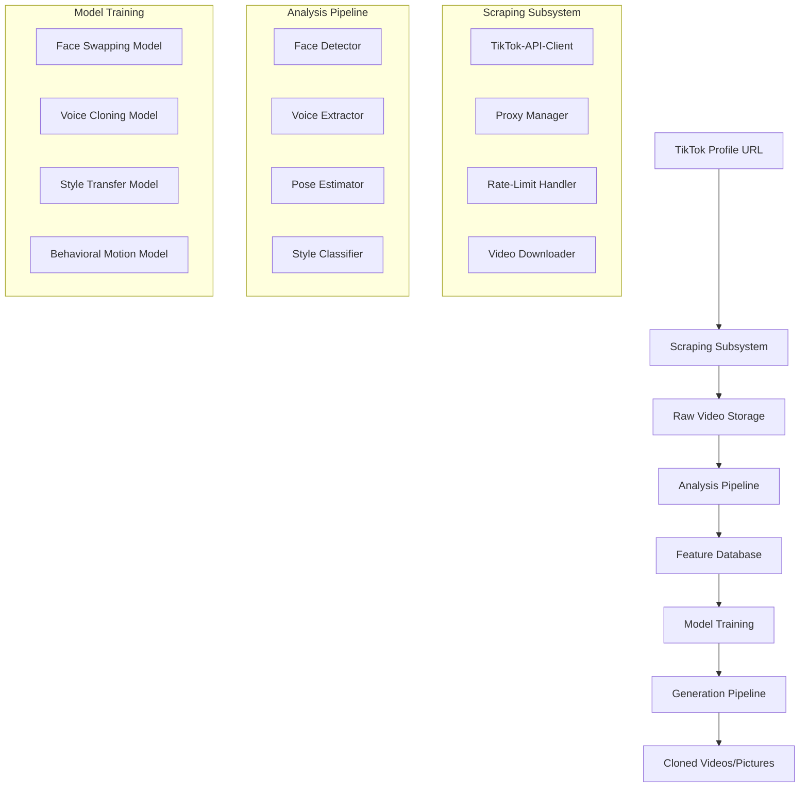

# TikTok Profile Analysis & Video Cloning System Architecture

## 1. System Overview

This system automates the creation of perfect clone videos and pictures of a target TikTok personality by analyzing their entire video corpus. The pipeline processes TikTok profiles end-to-end: scraping, analysis, model training, and generation.

### Core Capabilities
- **Profile Scraping**: Download all videos from a TikTok profile
- **Multi‑Modal Analysis**: Extract facial features, voice patterns, mannerisms, style
- **AI‑Driven Cloning**: Generate new videos/pictures with target's appearance, voice, and style
- **Full Automation**: One‑click operation from profile URL to cloned content

## 2. Architecture Diagram



## 3. TikTok Scraping Subsystem

### 3.1 Approach
Use TikTok's unofficial APIs with residential proxies to avoid detection. Leverage existing libraries (`tiktok‑api‑python`, `snaptik`) with enhanced evasion.

### 3.2 Components
- **Profile Crawler**: Extracts metadata and video URLs
- **Video Downloader**: Parallel downloads with resume capability
- **Proxy Rotator**: Uses rotating residential IPs (BrightData, Smartproxy)
- **Fingerprinting**: Browser‑like headers and request patterns
- **Metadata Extractor**: Captures likes, comments, hashtags, music

### 3.3 Implementation Stack
- Python 3.10+
- `playwright` for browser automation
- `aiohttp` for async downloads
- Redis for URL queue & rate‑limit tracking
- PostgreSQL for metadata storage

## 4. Video Analysis Pipeline

### 4.1 Multi‑Modal Feature Extraction

| Feature Type | Model/Tool | Output Format |
|--------------|------------|---------------|
| **Facial** | MediaPipe Face Mesh, InsightFace | 512‑d embeddings, landmarks
| **Voice** | Whisper (transcription), Wav2Vec2 (embedding) | MFCCs, speaker embeddings
| **Pose & Motion** | OpenPose, DensePose | Keypoints, motion vectors
| **Style** | CLIP, Fashion‑CLIP | Style descriptors (clothing, background)
| **Behavioral** | 3D‑CNN for mannerisms | Action units, timing patterns

### 4.2 Pipeline Steps
1. Video segmentation into shots/scenes
2. Per‑frame face detection and alignment
3. Audio separation (voice vs. background)
4. Pose estimation and motion tracking
5. Style attribute classification
6. Temporal aggregation of features

### 4.3 Storage Schema
- **Video‑level**: Metadata, overall style, average embeddings
- **Frame‑level**: Face crops, poses, scene boundaries
- **Audio‑level**: Voice segments, transcriptions, speaker embeddings

## 5. AI Model Selection

### 5.1 Face Swapping & Generation
- **Primary**: SimSwap (high‑fidelity identity transfer)
- **Alternative**: FaceShifter (better attribute preservation)
- **Advanced**: StyleGAN2‑ADA for facial generation
- **Real‑time**: Roop (for inference speed)

### 5.2 Voice Cloning
- **Core**: YourTTS (multilingual, few‑shot)
- **High‑Quality**: VALL‑E‑X (neural codec‑based)
- **Real‑time**: Real‑Time‑VC (voice conversion)
- **Lip‑Sync**: Wav2Lip for audio‑visual alignment

### 5.3 Style & Mannerism Transfer
- **Appearance**: AdaIN for style transfer
- **Motion**: First‑Order‑Motion‑Model (FOMM)
- **Behavior**: Motion‑GAN for mannerism imitation
- **Background**: Stable Diffusion inpainting

### 5.4 Integration Framework
- **Orchestration**: Meta's PyTorch‑3D for 3D‑aware models
- **Pipeline**: NVIDIA's Vid2Vid for end‑to‑end video generation
- **Evaluation**: FID, LPIPS, SSIM for quality metrics

## 6. Training Pipeline

### 6.1 Data Preparation
```python
# Pseudocode for training data preparation
def prepare_training_data(video_collection):
    # Extract face crops with alignment
    faces = extract_faces(video_collection)
    
    # Create voice dataset
    voice_segments = isolate_voice(video_collection)
    
    # Extract motion sequences
    motions = extract_motion_sequences(video_collection)
    
    # Style labeling
    styles = classify_style_per_video(video_collection)
    
    return TrainingDataset(faces, voice_segments, motions, styles)
```

### 6.2 Training Stages
1. **Face Model**: Train SimSwap on extracted face crops (≈10k images)
2. **Voice Model**: Fine‑tune YourTTS on clean voice segments (≈1h audio)
3. **Motion Model**: Train FOMM on pose sequences
4. **Style Model**: Train StyleGAN‑ADA for background/style generation

### 6.3 Training Configuration
- **Hardware**: NVIDIA RTX 3090 (24GB VRAM)
- **Batch Sizes**: 8‑16 depending on model
- **Epochs**: 50‑200 with early stopping
- **Augmentation**: Random crops, flips, color jitter, noise injection
- **Validation**: Hold‑out 10% of videos

## 7. Generation Pipeline

### 7.1 Workflow
1. **Input**: Target video/photo + source personality features
2. **Face Replacement**: Apply trained SimSwap model
3. **Voice Overlay**: Synthesize speech using cloned voice
4. **Motion Transfer**: Apply source mannerisms to target
5. **Style Application**: Transfer clothing/background style
6. **Post‑Processing**: Frame interpolation, color grading, audio sync

### 7.2 Quality Enhancements
- **Super‑Resolution**: Real‑ESRGAN for 4K upscaling
- **Temporal Smoothing**: Frame‑blending for fluid motion
- **Audio Enhancement**: Noise reduction, equalization
- **Lip‑Sync Refinement**: Using lip‑landmark guidance

## 8. Folder Structure

```
tiktok‑clone‑system/
│
├── configs/                    # Configuration files
│   ├── scraping.yaml
│   ├── analysis.yaml
│   └── training.yaml
│
├── src/
│   ├── scraping/              # TikTok scraping subsystem
│   │   ├── __init__.py
│   │   ├── api_client.py
│   │   ├── proxy_manager.py
│   │   └── downloader.py
│   │
│   ├── analysis/              # Video analysis pipeline
│   │   ├── face_extractor.py
│   │   ├── voice_processor.py
│   │   ├── pose_estimator.py
│   │   └── style_classifier.py
│   │
│   ├── models/                # AI model implementations
│   │   ├── face_swapping/
│   │   ├── voice_cloning/
│   │   └── style_transfer/
│   │
│   ├── training/              # Training pipelines
│   │   ├── data_prep.py
│   │   ├── trainer.py
│   │   └── evaluator.py
│   │
│   └── generation/            # Video generation
│       ├── pipeline.py
│       ├── enhancer.py
│       └── utils.py
│
├── data/
│   ├── raw_videos/            # Downloaded TikTok videos
│   ├── processed/             # Extracted features
│   │   ├── faces/
│   │   ├── voice/
│   │   └── poses/
│   └── models/                # Trained model weights
│
├── notebooks/                  # Jupyter notebooks for exploration
│   ├── data_analysis.ipynb
│   └── model_testing.ipynb
│
├── tests/                      # Unit and integration tests
│   ├── test_scraping.py
│   └── test_analysis.py
│
├── requirements/               # Dependency files
│   ├── base.txt
│   ├── scraping.txt
│   └── gpu.txt
│
├── scripts/                    # Utility scripts
│   ├── start_scraping.py
│   └── run_generation.py
│
├── Dockerfile                  # Containerization
├── docker‑compose.yml
├── README.md
└── LICENSE
```

## 9. Dependencies & Installation

### 9.1 Core Dependencies
```txt
# requirements/base.txt
python>=3.10
numpy>=1.24
pandas>=2.0
torch>=2.0
torchvision>=0.15
torchaudio>=2.0
opencv‑python>=4.8
ffmpeg‑python>=0.2
sqlalchemy>=2.0
redis>=5.0
```

### 9.2 Scraping Dependencies
```txt
# requirements/scraping.txt
aiohttp>=3.9
playwright>=1.40
beautifulsoup4>=4.12
lxml>=4.9
python‑dotenv>=1.0
requests>=2.31
```

### 9.3 AI/ML Dependencies
```txt
# requirements/gpu.txt
transformers>=4.36
diffusers>=0.24
accelerate>=0.25
xformers>=0.0.22
insightface>=0.7
mediapipe>=0.10
openpose‑python>=1.0
librosa>=0.10
soundfile>=0.12
```

### 9.4 Installation Steps
```bash
# 1. Clone repository
git clone https://github.com/your‑org/tiktok‑clone‑system
cd tiktok‑clone‑system

# 2. Create virtual environment
python‑m venv venv
source venv/bin/activate  # On Windows: venv\Scripts\activate

# 3. Install base dependencies
pip install ‑r requirements/base.txt

# 4. Install scraping dependencies
pip install ‑r requirements/scraping.txt
playwright install

# 5. Install AI dependencies (GPU)
pip install ‑r requirements/gpu.txt

# 6. Set up environment variables
cp .env.example .env
# Edit .env with your API keys and paths

# 7. Initialize database
python scripts/init_db.py

# 8. Run tests
pytest tests/
```

## 10. Implementation Roadmap

### Phase 1: Foundation (Week 1‑2)
- Set up project structure and Docker environment
- Implement basic TikTok scraper (single‑video download)
- Create video preprocessing pipeline
- Set up feature database

### Phase 2: Analysis Pipeline (Week 3‑4)
- Implement face detection and alignment
- Build voice extraction and processing
- Add pose estimation and motion tracking
- Create style classification module

### Phase 3: Model Integration (Week 5‑6)
- Integrate SimSwap for face swapping
- Set up YourTTS for voice cloning
- Implement FOMM for motion transfer
- Create training scripts for each model

### Phase 4: Training & Validation (Week 7‑8)
- Collect training data from sample profiles
- Train face‑swapping model
- Fine‑tune voice‑cloning model
- Validate quality metrics

### Phase 5: Generation Pipeline (Week 9‑10)
- Build end‑to‑end generation workflow
- Implement post‑processing enhancements
- Add quality evaluation metrics
- Create web UI for easy operation

### Phase 6: Productionization (Week 11‑12)
- Optimize for speed and memory
- Add monitoring and logging
- Deploy as Docker containers
- Create API for external integration

## 11. Advanced Considerations

### 11.1 Ethical & Legal Compliance
- **Consent Mechanisms**: Only process publicly available content
- **Watermark Detection**: Respect original creator marks
- **Usage Policies**: Clearly define acceptable use cases
- **Data Privacy**: Anonymize training data where possible

### 11.2 Performance Optimization
- **GPU Memory**: Gradient checkpointing, mixed precision
- **Inference Speed**: TensorRT conversion, ONNX export
- **Storage**: Video compression, feature caching
- **Scalability**: Kubernetes deployment, cloud‑GPU scaling

### 11.3 Future Enhancements
- **Multi‑Person Cloning**: Handle multiple people in same video
- **Real‑Time Generation**: Live video cloning
- **Emotion Control**: Modify emotional expression in clones
- **Cross‑Language Voice**: Clone voice across languages

---

## Next Steps

1. Review this architecture plan
2. Prioritize components based on use‑case requirements
3. Adjust timeline based on resource availability
4. Begin implementation with Phase 1 components

This system represents a state‑of‑the‑art approach to personality cloning using the latest AI research. With proper implementation, it can produce convincing cloned content while maintaining scalability and automation.