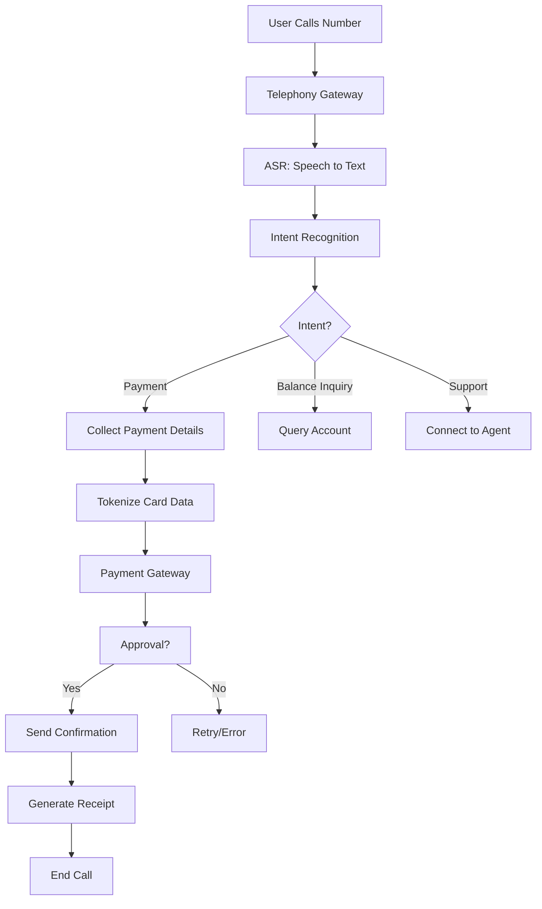
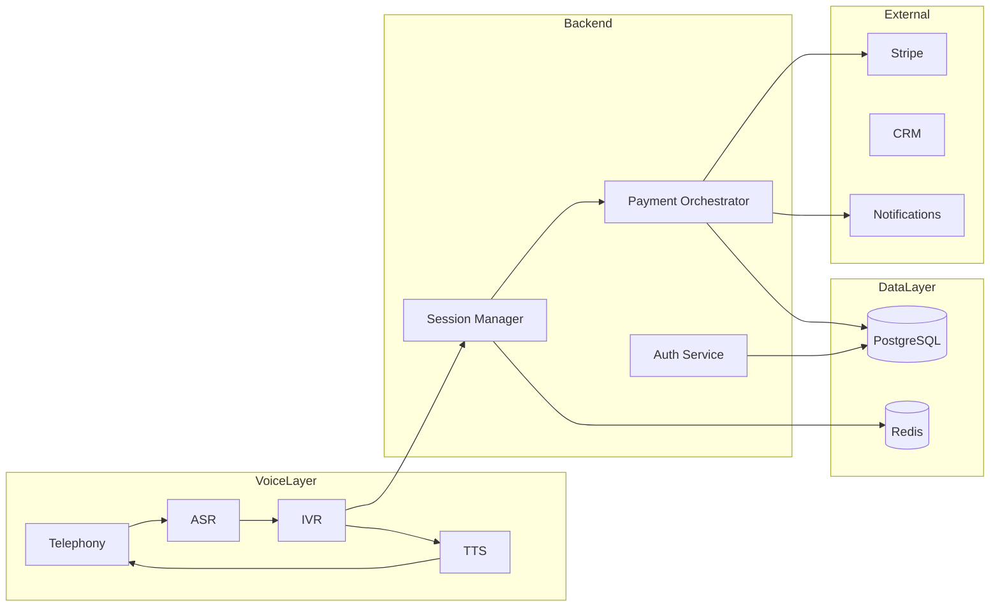

# Voice Payment Gateway - System Architecture

## Overview
A system where users call a phone number, interact via voice, and complete payments securely.

## Components

### 1. Voice Interface Layer
- **Telephony Gateway**: Handles incoming calls (Twilio, Plivo, or custom SIP)
- **Voice Recognition (ASR)**: Converts speech to text (Google Speech‑to‑Text, AWS Transcribe, or Whisper)
- **Text‑to‑Speech (TTS)**: Converts system responses to voice (Amazon Polly, Google TTS)
- **IVR Engine**: Interactive Voice Response logic, menu navigation

### 2. Backend Services
- **Call Session Manager**: Tracks call state, user context, and session data
- **Payment Orchestrator**: Coordinates payment flow, validation, and routing
- **User Authentication**: Verifies caller identity via PIN, voice biometrics, or phone number
- **Transaction Database**: Stores payment records, call logs, and audit trails

### 3. Payment Processing Layer
- **Payment Gateway Integration**: Stripe, Square, PayPal, or custom bank APIs
- **PCI‑DSS Compliance**: Secure handling of card data (tokenization, encrypted storage)
- **Fraud Detection**: Real‑time fraud scoring, velocity checks, anomaly detection

### 4. External Integrations
- **CRM Systems**: Sync customer data (Salesforce, HubSpot)
- **Accounting Software**: QuickBooks, Xero for reconciliation
- **Notification Services**: Email/SMS receipts (SendGrid, Twilio SMS)

### 5. Monitoring & Analytics
- **Call Quality Monitoring**: Real‑time metrics, latency, ASR accuracy
- **Transaction Dashboard**: Admin dashboard for viewing payments, disputes, reports
- **Logging & Alerts**: Centralized logging (ELK stack), alerting on failures

## Data Flow
1. **Call Initiation**
   - User dials phone number → telephony gateway receives call
   - Gateway creates session, forwards audio to ASR
2. **Voice Interaction**
   - ASR transcribes user utterance → intent recognition
   - IVR logic determines next step (e.g., "Please say the amount to pay")
   - TTS generates spoken response
3. **Payment Collection**
   - System prompts for payment details (card number, expiry, CVV via DTMF or voice)
   - Data tokenized, sent to payment gateway
   - Gateway returns approval/denial
4. **Confirmation**
   - TTS reads confirmation, sends receipt via SMS/email
   - Session ends, call logs stored

## Technology Stack
- **Backend**: Node.js/Python (FastAPI/Express) for real‑time APIs
- **Database**: PostgreSQL (transaction data), Redis (session cache)
- **Voice Platform**: Twilio Programmable Voice (or open‑source Asterisk/Freeswitch)
- **ASR/TTS**: Google Cloud Speech‑to‑Text & Text‑to‑Speech
- **Payment Gateway**: Stripe API (sandbox initially)
- **Infrastructure**: Docker, Kubernetes (optional), AWS/GCP
- **Monitoring**: Prometheus, Grafana, Sentry

## Security Considerations
- **PCI Compliance**: Never store raw card data; use tokenization
- **Voice Security**: Biometric verification, anti‑spoofing measures
- **Network Security**: TLS for all communications, firewall, intrusion detection
- **Data Encryption**: At‑rest and in‑transit encryption
- **Access Control**: Role‑based access for admin dashboards

## Deployment Architecture
- **Microservices**: Each component deployable independently
- **Load Balancer**: Distributes call traffic across multiple instances
- **High Availability**: Active‑active redundancy for critical services
Material, Kubernetes for orchestration
- **Disaster Recovery**: Multi‑region backups, failover procedures

## Next Steps
1. Set up development environment with Twilio sandbox
2. Implement basic IVR flow (menu, capture digits)
3. Integrate Stripe test payments
4. Add session persistence and authentication
5. Build admin dashboard
6. Deploy to cloud, test with real calls

## Diagrams (Mermaid)

